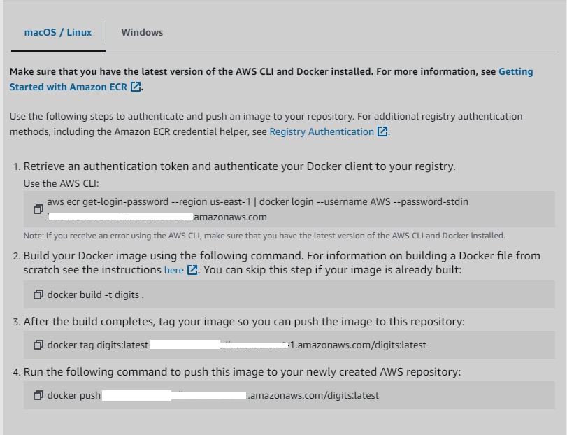

# 1) About the project

## 1.1) Problem

There are non-editable files, such as jpg, png and pdf. If you want to make these editable text files, you must convert their content (an image) and parse it to text.

OCR (Optical Character Recognition) are the techniques that seek to achieve this goal. In this case, we will use the classic MNIST dataset to convert images of digits into their respective characters.

## 1.2) Results

- The model was deployed in aws


- Metrics


| precision | recall | f1-score | support |
| :-------- | :----: | :------: | ------: |
| 0.94      |  0.98  |   0.96   |     980 |
| 0.97      |  0.98  |   0.98   |    1135 |
| 0.94      |  0.90  |   0.92   |    1032 |
| 0.90      |  0.92  |   0.91   |    1010 |
| 0.93      |  0.93  |   0.93   |     982 |
| 0.92      |  0.88  |   0.90   |     892 |
| 0.94      |  0.95  |   0.95   |     958 |
| 0.94      |  0.91  |   0.92   |    1028 |
| 0.89      |  0.89  |   0.89   |     974 |
| 0.91      |  0.91  |   0.91   |    1009 |

The model is very good classifying between 0,1,2 and 7 but a little worse classify 3 and 7.

# 2) Contents of the folder

```
├── app
│ ├── digits.tflite
│ ├── Dockerfile
│ ├── requirements.txt
│ ├── service.py
├── notebook.ipynb
├── Pipfile
├── Pipfile.lock
├── train.py
└── predict.py
```


* Note: Dataset is iternal to keras 

# 3) Environment installation

Clone the proyect

```
git clone https://github.com/alejomaar/Machine-Learning-Zoomcamp.git
```

Move to proyect

```
cd "Capstone 1"
```

Create virtualenv

```
pipenv install
```

Activate virtualenv

```
pipenv shell
```

Move to app

```
cd app
```

Build container

```
docker image build -t digits .
```

```
docker image build -t digits .
```

`The environment it's ready`

# 4) Run code

- If you want check EDA/Analysis process run notebook.ipynb
- If you want retrain the model run `python train.py`
- If you want deploy a service run in app folder `uvicorn service:app --reload`
- If you want build the container run in app folder `docker run -it --rm -p 3000:3000 digits:latest`

# 6) Deploy to cloud

We need to create a docker image with BentoML


Most of the steps are done directly from AWS. Watch this video to see the complete step by step

`https://www.youtube.com/watch?v=aF-TfJXQX-w&list=PL3MmuxUbc_hIhxl5Ji8t4O6lPAOpHaCLR&index=72`

#### Create a ECR in AWS

Click in `view push command`

- Authentication
  `aws ecr get-login-password --region [your_region] | docker login --username AWS --password-stdin [your_url]`

- Look `tag` of this project
  `docker images`

- tag your image
  `docker tag digits:latest:[`tag`] `your aws url` /digits:latest`

- push image in aws with the `tag` of image
  `docker push `your url`/digits:latest `

`Note`: You can check all commands in your aws account



#### Create a ECS in AWS

In AWS ECS section

- Create a cluster
- Create a task
- Attach image container to task
- Enable port 3000 in tcp
- Run the task
- Open the public url in port 3000

Link Service

http://3.92.196.77:3000/docs#/default/analyze_route_analyze_post

it may not work to avoid cost

