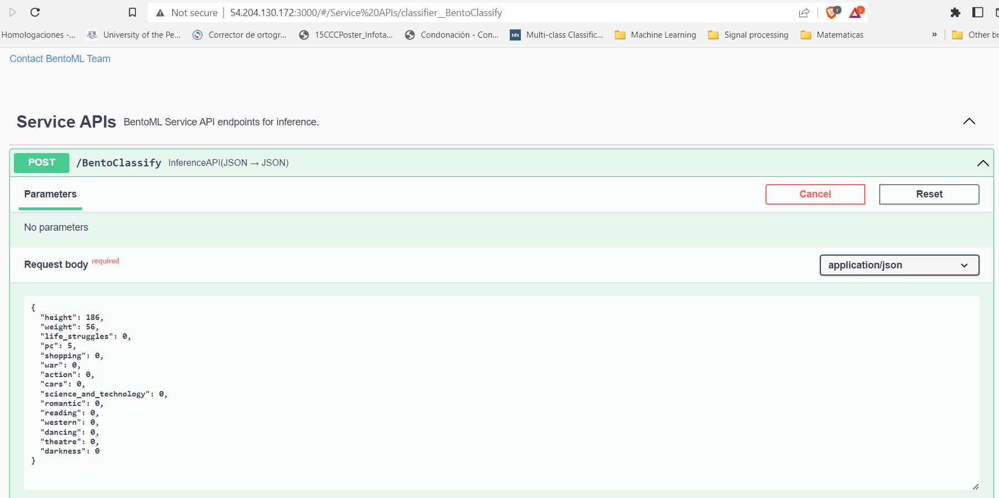
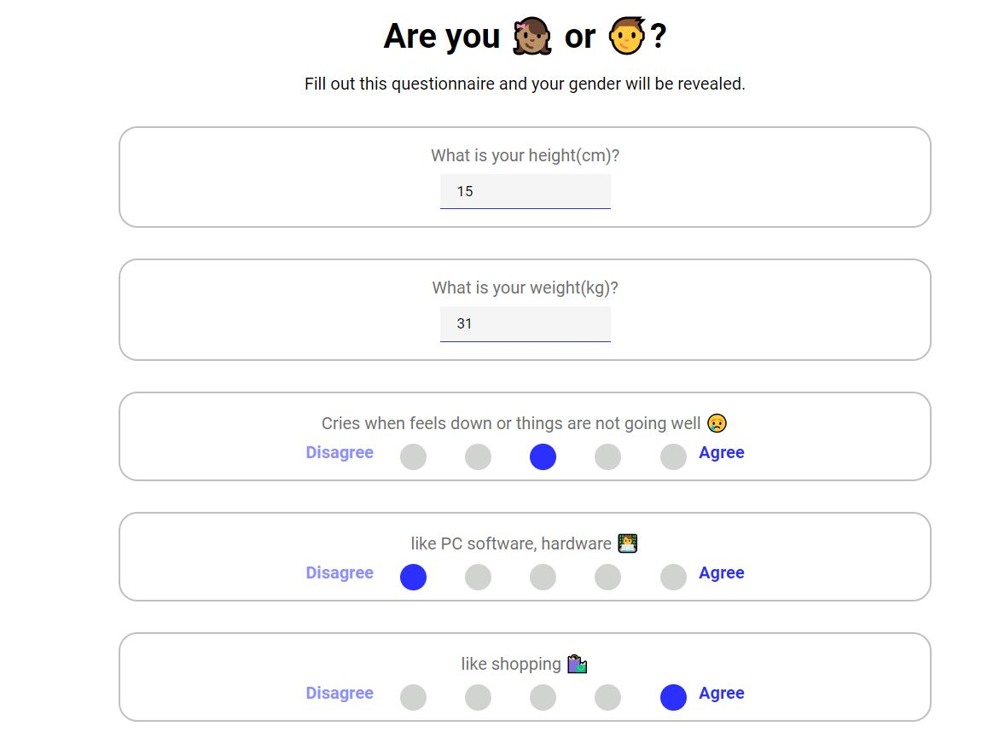

# 1) About the project

## 1.1) Motivation

In the age of data and machine learning, information may not be as anonymous as you think. Your identity and characteristics may be revealed if other information about you is obtained. This project looks at how a personality test can reveal your male or female gender.

## 1.2) Business context

Good morning recruit! It's good to have you here! In our company PSYCAR needs to collect demographic information about our customers. For legal reasons we cannot collect the name or gender of the person, but we can collect any other type of information.

We need you to build a personality test, to understand if the person who answered it is male or female, since we need this information for our next marketing campaign.

Just be careful not to design a very long quiz, as the user might abandon it.

Thanks,

Mr McManager

# 2) Contents of the folder

```
├── webpage
│ ├── package.json
│ ├── src
│ ├── public
├── bentofile.yaml
├── bento.bentomodel
├── columns.csv
├── responses.csv
├── notebook.ipynb
├── Pipfile
├── Pipfile.lock
├── requirements.txt
├── train.py
└── predict.py
```

The code folder consists of:

- Data Cleaning/EDA/model tunning - notebook.py </li>
- responses.csv and columns.csv the data from [Kaggle](https://www.kaggle.com/datasets/miroslavsabo/young-people-survey) - notebook.py </li>
- train the final model + saving it using bentoml - train.py </li>
- load the model and serve it via a web service - predict.py </li>
- Create Virtunal Environment - Pipenv and Pipenv.lock </li>
- Containerize service and deploy cloud - bentoml.file & bento.bentomodel </li>
- (EXTRA) Webpage using React - webpage folder </li>

# 3) Environment installation

Clone the proyect

```
git clone https://github.com/alejomaar/Machine-Learning-Zoomcamp.git
```

Move to proyect

```
cd Midterm_proyect
```

Create virtualenv

```
pipenv install
```

Activate virtualenv

```
pipenv shell
```

Import bentos

```
bentoml models import bento.bentomodel
```

OPTIONAL (Run React frontend)

`!You must have npm and yarn installed`

move into webpage folder

```
cd Midterm_proyect/classifier
```

install packages

```
yarn install
```

`The environment it's ready`

# 4) Run code

- If you want check EDA/Analysis process run notebook.ipynb
- If you want retrain the model run `python train.py`
- If you want deploy a service run `bentoml serve predict.py:svc
- OPTIONAL If you want interact with service via frontend `yarn start` (in classifier folder)`

# 5) How the deployed services look

BentoML Service
`Note`: It is already deployed in aws, check the url



Webpage



# 6) Deploy to cloud

In this case we do not interact directly with docker, bentoml does it for us.

bash

```
bentoml containerize classifier:p774qfs5f6uoqlhq
```

Most of the steps are done directly from AWS. Watch this video to see the complete step by step

https://www.youtube.com/watch?v=aF-TfJXQX-w&list=PL3MmuxUbc_hIhxl5Ji8t4O6lPAOpHaCLR&index=72

# 7) Results

This project achieves:

- An accuracy and auc of 94% for the `male` or `female` gender classification
- Deploy a service with bentoML and fastAPI
- Upload the service to AWS using ECR and ECS
- Build a frontend application to consume AWS services
- Manage virtual environment for replicability
