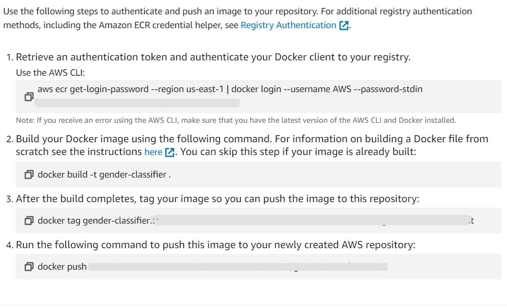

# 1) About the project

## 1.1) Business context

Good morning recruit! It's good to have you here! Our company Apool needs you to build a personality test, the data from this test must be processed with a classifier that identifies whether the user is male or female. This information will be important to our marketing team.

The company has a dataset in the `responses.csv` file (also in [Kaggle](https://www.kaggle.com/datasets/miroslavsabo/young-people-survey)) for you can do this job.

We also need to deploy the model in the cloud and design a friendly interface where the user can answer this test.

Be careful not to design a very long questionnaire, since the user could abandon it. the original dataset has 150 questions, we expect the final questionnaire to have less than this.

Thank you,

Mr McManager

## 1.2) Results

- The model was deployed in aws


- (EXTRA) React page was developed to consume the service.


[Evidence](https://www.linkedin.com/posts/manuelalejandroaponte_66daysofdata-mlzoomcamp-kaggle-activity-6994893310196600832-eWQL?utm_source=share&utm_medium=member_desktop)

- Metrics

| Class  | Precision | Recall | f1-score |
| :----- | :-------: | :----: | -------: |
| male   |   0.96    |  0.93  |     0.94 |
| female |   0.93    |  0.96  |     0.95 |

`Of 150 characteristics, only 15 were taken for these results.`

# 2) Contents of the folder

```
├── webpage
│ ├── package.json
│ ├── src
│ ├── public
├── bentofile.yaml
├── bento.bentomodel
├── columns.csv
├── responses.csv
├── notebook.ipynb
├── Pipfile
├── Pipfile.lock
├── requirements.txt
├── train.py
└── predict.py
```

The code folder consists of:

- Data Cleaning/EDA/model tunning - notebook.py </li>
- responses.csv and columns.csv the data from [Kaggle](https://www.kaggle.com/datasets/miroslavsabo/young-people-survey) - notebook.py </li>
- train the final model + saving it using bentoml - train.py </li>
- load the model and serve it via a web service - predict.py </li>
- Create Virtunal Environment - Pipenv and Pipenv.lock </li>
- Containerize service and deploy cloud - bentoml.file & bento.bentomodel </li>
- (EXTRA) Webpage using React - webpage folder </li>

[Post](https://www.linkedin.com/posts/manuelalejandroaponte_66daysofdata-mlzoomcamp-kaggle-activity-6994893310196600832-eWQL?utm_source=share&utm_medium=member_desktop)

# 3) Environment installation

Clone the proyect

```
git clone https://github.com/alejomaar/Machine-Learning-Zoomcamp.git
```

Move to proyect

```
cd Midterm_proyect
```

Create virtualenv

```
pipenv install
```

Activate virtualenv

```
pipenv shell
```

Import bentos

```
bentoml models import bento.bentomodel
```

OPTIONAL (Run React frontend)

`!You must have npm ,yarn and node.js installed`

move into webpage folder

```
cd Midterm_proyect/webpage
```

install packages

```
yarn install
```

`The environment it's ready`

# 4) Run code

- If you want check EDA/Analysis process run notebook.ipynb
- If you want retrain the model run `python train.py`
- If you want deploy a service run `bentoml serve predict.py:svc
- OPTIONAL If you want interact with service via frontend `yarn start` (in webpage folder)`

# 6) Deploy to cloud

We need to create a docker image with BentoML

```
bentoml containerize classifier:p774qfs5f6uoqlhq
```

Most of the steps are done directly from AWS. Watch this video to see the complete step by step

`https://www.youtube.com/watch?v=aF-TfJXQX-w&list=PL3MmuxUbc_hIhxl5Ji8t4O6lPAOpHaCLR&index=72`

#### Create a ECR in AWS

Click in `view push command`

- Authentication
  `aws ecr get-login-password --region [your_region] | docker login --username AWS --password-stdin [your_url]`

- Look `tag` of this project
  `docker images`

- tag your image
  `docker tag gender-classifier:[`tag`] `your aws url` gender-classifier:latest`

- push image in aws with the `tag` of image
  `docker push `your url`/gender-classifier:latest `

`Note`: You can check all commands in your aws account



#### Create a ECS in AWS

In AWS ECS section

- Create a cluster
- Create a task
- Attach image container to task
- Enable port 3000 in tcp
- Run the task
- Open the public url in port 3000

Link Service

http://54.204.130.172:3000/#/Service%20APIs/classifier__BentoClassify

it may not work because it stops service to avoid costs

[Evidence](https://www.linkedin.com/posts/manuelalejandroaponte_66daysofdata-mlzoomcamp-kaggle-activity-6994893310196600832-eWQL?utm_source=share&utm_medium=member_desktop)
